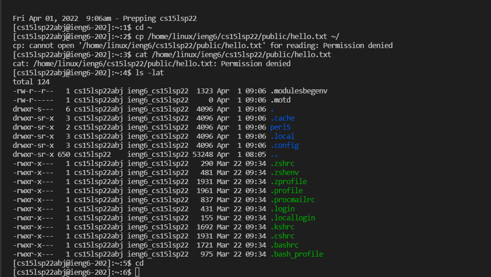

# WEEK 2 LAB REPORT
 
## Installing VSCode
 
I went to the Visual Code Studio website [here](https://code.visualstudio.com/) and installed it.  
 

 
 
## Remotely Connecting
 
I installed OpenSSH using [this link](https://docs.microsoft.com/en-us/windows-server/administration/openssh/openssh_install_firstuse) and then checked my CSE 15L account [here](https://sdacs.ucsd.edu/~icc/index.php)
 
I typed out the `ssh` command using my account name and got this after accepting the messages and entering my password:
 

 
We all noticed the same messages popping up when we were trying to login and the almost same output appeared for our group members except for the specifics like the time, number of users, hostnames, etc. as we all logged into different accounts at different times.
 
## Trying Some Commands
 
I tried running some commands and figuiring out what they do.
 

 
`cp /home/linux/ieng6/cs15lsp22/public/hello.txt ~/` and `cat /home/linux/ieng6/cs15lsp22/public/hello.txt`
 showed _"Permission Denied"_ when I tried running it on the remote computer. However, these commands displayed my files when I ran these commands on my computer. This shows that on the remote computer, these commands try to access some other student's details which is not allowed.
 
`ls-lat` lists the files of the directory that we are trying to access. This command sorts the files in chronological order and it also shows hidden files, all files are displayed along with the file details.
 
## Moving Files with scp
 
While not being logged into the ieng6 account, I created a file called `WhereAmI.java` with the following code:

```
class WhereAmI {
    public static void main(String[] args) {
      System.out.println(System.getProperty("os.name"));
      System.out.println(System.getProperty("user.name"));
      System.out.println(System.getProperty("user.home"));
      System.out.println(System.getProperty("user.dir"));
    }
  }
  
```
 
After running the javac and java commands, it shows my OS and username.
 

 
When I use the `scp` command, it prompts for a password.
 

 
Now, if I login to my ieng6 account again and use the ls command, it lists the files in the directory.
 
## Setting the SSH keys
 
Using `ssh-keygen` saves us time as we do not have to enter our passwords. It creates a pair of public and provate files saved at different locations of the server and client respectively and it uses these files as a replacement for our password.
 
This is what I got after using the keygen command:
 

 
After setting up keygen, I used to `ssh` command to login to my ieng6 account and I did not get prompted for the password.
 

 
If we run the `WhereAmI.java` file again, we do not need to input the password there too.
 
 
## Optimizing Remote Running
 
There are ways to make remote running easier and quicker.
 
For example, upward arrows help us to access previous commands that we ran, so we don't have to type them again.
 
Some commands that are written as 2 separate commands can be merged into one command
 

 
 
## The End
_Thank You_

