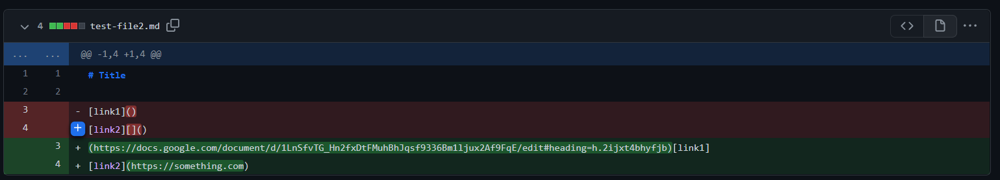

# WEEK 4 LAB REPORT 

## The First Change

I changed the original code of `MarkdownParse.java` to accomodate a case like [this](https://github.com/Maanasa64/markdown-parser/commit/03c8bf4a407bd5305550be13e85b2709265c32a7)

I made a [new file](https://github.com/Maanasa64/markdown-parser/commit/cf45f57b5954677481483791a5c6868996ffc8ce#diff-c1ee2d48f5f64b4463a98907818b5846f49cc9dd67f88882a8b551106ec320fb) that contains the the input that shows the failure.

*Ouput-*

`Exception in thread "main" java.lang.OutOfMemoryError: Java heap space      
        at java.base/java.util.Arrays.copyOfRange(Arrays.java:3822)
        at java.base/java.lang.StringLatin1.newString(StringLatin1.java:769)
        at java.base/java.lang.String.substring(String.java:2709)
        at MarkdownParse.getLinks(MarkdownParse.java:19)
        at MarkdownParse.main(MarkdownParse.java:30)`
       
       
 *Expected-*
 
`[https://something.com, some-thing.html]`

Explaination- 

The previous code that was given to us only checks the file for the brakets and paranthesis in a particular order and thus it shows an error when we but a braket agter the paranthesis after the link. This can be fixed by replacing the while loop with a for loop that only reads the file till the paranthesis closes. We must also remove the line `currentIndex = closeParen + 1;` Thus, by the for loop, the variable `currentIndex` is continuously being added to the value of `closeParen` everytime the for loop iterates. Thus, it stops iterating after the last paranthesis and doesn't consider the close Bracket that we have added in the end, giving us the right output.

## The Second Change

The second change made to `MarkdownParse.java` can be found [here](https://github.com/Maanasa64/markdown-parser/commit/77c69bf4e3af7db8610af5ca2944401822207953)

I edited the file to [this](https://github.com/Maanasa64/markdown-parser/commit/77c69bf4e3af7db8610af5ca2944401822207953#diff-c1ee2d48f5f64b4463a98907818b5846f49cc9dd67f88882a8b551106ec320fb)

*Output-*

`[, ]`

*Expected-*

`[]`

Explaination-

Fixed this error with an if-else statement. If there is no link in the parentheis or/and if there is no text in the bracket, the output should be an empty list. The if statement checks that if the difference between the `closeParen` and `openParen` is less than or equal to 1, then the code is not supposed to do anything, thus it returns an empty list by default. 

## The Third Change

Lastly, I edited the file to [this](https://github.com/Maanasa64/markdown-parser/commit/fb70d343252ab5b4983d7df532982062952f1756)

