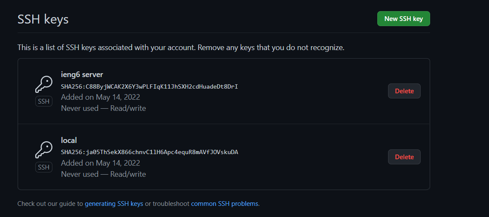
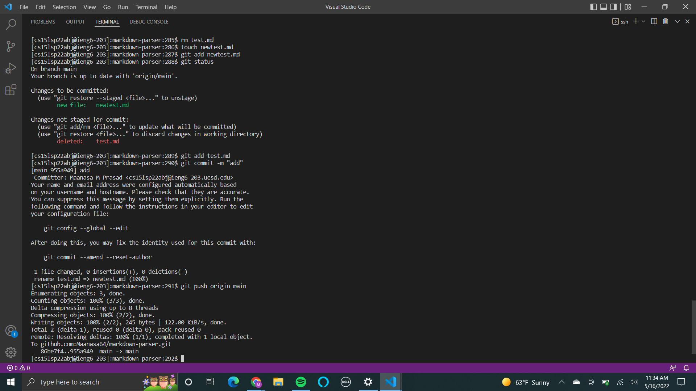
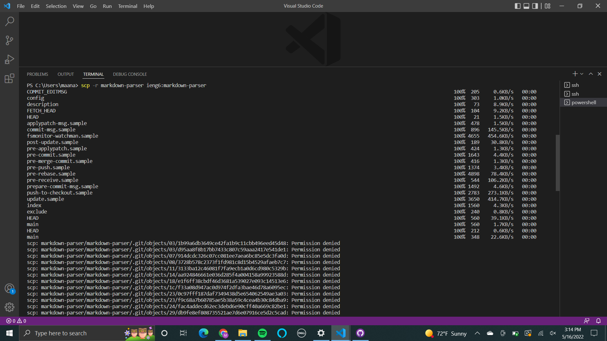
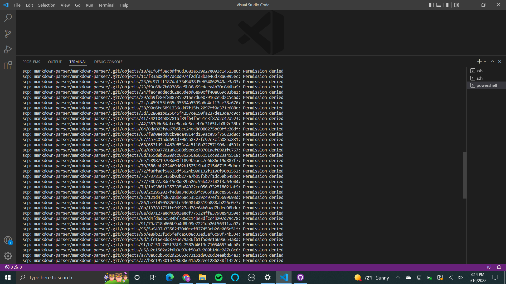
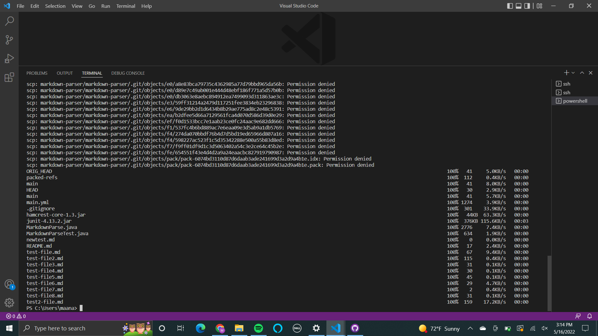
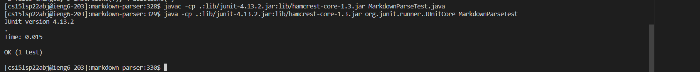

# WEEK 6 LAB REPORT

## Streamlining ssh Configuration

The `ssh/config` file that is shown below is edited using VSCode. I opened the `.ssh` file on VSCode and added the new file called `config` and copy pasted the lines. 

As the image below dipicts, I logged into my account by using the `ssh ieng6` command where my alias is ieng6.

To add a file to my account, I used the `scp` command. I made a new text file called `empty.txt` in my Downloads and then copied it to my ieng account with `scp`. I logged in and used the `ls` command to see if it copied. 

## Setup Github Access from ieng6

The public keys stored on Github-

The public key stored in my user account-

I added a new empty `newtest.md` to `markdown-parser` from my ieng6 account. I then committed the new file and pushed the origin.

This file got added on the github repository and is visible after going on the following link

[Link](https://github.com/Maanasa64/markdown-parser)

## Copy whole directories with scp -r

Below, the image shows how i used the `scp -r` command to copy the entire `markdown-parser` directory to my ieng6 account

I tried logging in on my ieng6 account to run the JUnit tests on `MarkdownParseTest.java` 

