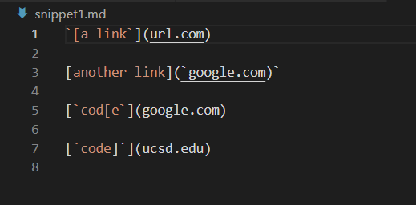

# WEEK 8 LAB REPORT 

## Link to my markdown-parser repository:
[Link1](https://github.com/Maanasa64/markdown-parser)

## Link to the markdown-parser repository that I reviewed:
[Link2](https://github.com/markruangrattham/markdown-parser)

## Snippet 1

*Code*

```
[a link](url.com)

another link`

cod[e

code]
```

*Preview*



*Testing on my markdown parser*


*Testing on the reviewed markdown parser*


## Snippet 2

*Code*

```
[a [nested link](a.com)](b.com)

[a nested parenthesized url](a.com(()))

[some escaped \[ brackets \]](example.com)
```

*Preview*


*Testing on my markdown parser*


*Testing on the reviewed markdown parser*


# Snippet 3

```
[this title text is really long and takes up more than 
one line

and has some line breaks](
    https://www.twitter.com
)

[this title text is really long and takes up more than 
one line](
https://sites.google.com/eng.ucsd.edu/cse-15l-spring-2022/schedule
)


[this link doesn't have a closing parenthesis](github.com

And there's still some more text after that.

[this link doesn't have a closing parenthesis for a while](https://cse.ucsd.edu/


)

And then there's more text
```

*Preview*


*Testing on my markdown parser*


*Testing on the reviewed markdown parser*


