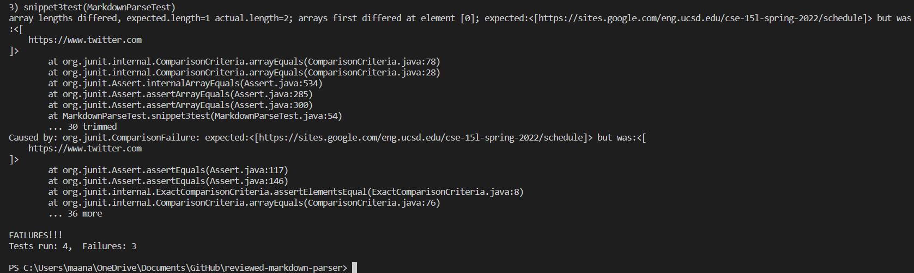

# WEEK 8 LAB REPORT 

## Link to my markdown-parser repository:
[Link1](https://github.com/Maanasa64/markdown-parser)

## Link to the markdown-parser repository that I reviewed:
[Link2](https://github.com/markruangrattham/markdown-parser)

## Snippet 1

*Code*

```
[a link](url.com)

another link`

cod[e

code]
```

*Preview*


*Code for snippet1 in `MarkdownParseTest.java`*


*Testing on my markdown parser*


*Testing on the reviewed markdown parser*


## Snippet 2

*Code*

```
[a [nested link](a.com)](b.com)

[a nested parenthesized url](a.com(()))

[some escaped \[ brackets \]](example.com)
```

*Preview*


*Code for snippet2 in `MarkdownParseTest.java`*


*Testing on my markdown parser*


*Testing on the reviewed markdown parser*


# Snippet 3

```
[this title text is really long and takes up more than 
one line

and has some line breaks](
    https://www.twitter.com
)

[this title text is really long and takes up more than 
one line](
https://sites.google.com/eng.ucsd.edu/cse-15l-spring-2022/schedule
)


[this link doesn't have a closing parenthesis](github.com

And there's still some more text after that.

[this link doesn't have a closing parenthesis for a while](https://cse.ucsd.edu/


)

And then there's more text
```

*Preview*


*Code for snippet3 in `MarkdownParseTest.java`*


*Testing on my markdown parser*


*Testing on the reviewed markdown parser*




**Questions**

Q1: Do you think there is a small (<10 lines) code change that will make your program work for snippet 1 and all related cases that use inline code with backticks? If yes, describe the code change. If not, describe why it would be a more involved change.

Ans: Yes, there is a small (<10 lines) code change that will make my program work for snippet 1 and all related cases that use inline code with backticks. We should add an if statement that disregards the backticks if they exist within the [] so that it is considered as the name of the link.

Q2: Do you think there is a small (<10 lines) code change that will make your program work for snippet 2 and all related cases that nest parentheses, brackets, and escaped brackets? If yes, describe the code change. If not, describe why it would be a more involved change.

Ans: Yes, there is a small (<10 lines) code change that will make my program work for snippet 2 and all related cases that nest parentheses, brackets, and escaped brackets. All that needs to be done is the addition of an if statement that checks for extra parantheses or brackets inside the link and then these should be disregarded. 

Q3: Do you think there is a small (<10 lines) code change that will make your program work for snippet 3 and all related cases that use inline code with backticks? If yes, describe the code change. If not, describe why it would be a more involved change.

Ans: Yes, there is a small (<10 lines) code change that will make my program work for snippet 3 and all related cases that use inline code with backticks. I need to  put an if statement that checks if the links are broken over multiple lines. We should disregard the titles with line breaks and consider a long title that can take up multiple lines
