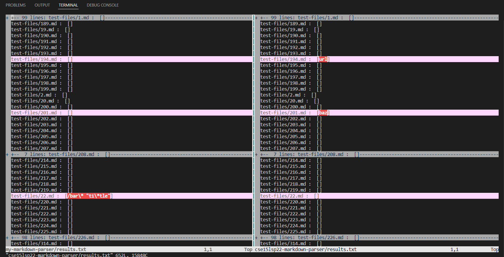
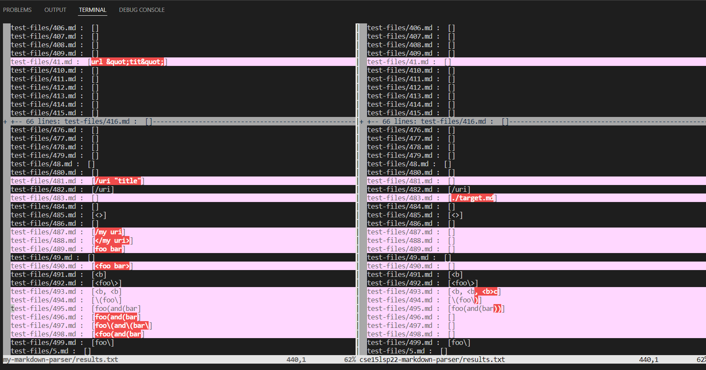
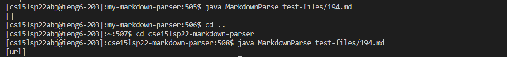
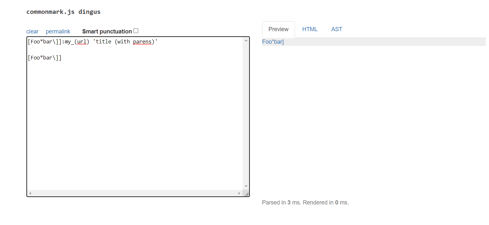
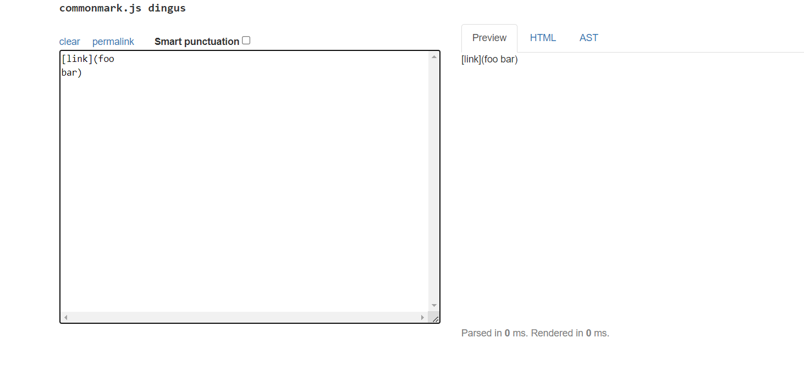

# LAB REPORT 5

I used `vimdiff my-markdown-parser/results.txt cse15lsp22-markdown-parser/results.txt'` on the results.txt file that we create after running a bash for-loop that exists 
in the `script.sh` file. Before this, I used the command `bash script.sh > results.txt` that saves the output of each result of the `.md` files to a separate file. After 
this, the `vimdiff` command helps us find the tests with different results. 

Our output looks like this-





## Test file 1

In the above image, we can see that `test-files/194.md` has different outputs. The test can be found here[https://github.com/nidhidhamnani/markdown-parser/blob/main/test-files/194.md]

The code in this file is:
```
[Foo*bar\]]:my_(url) 'title (with parens)'

[Foo*bar\]]
```

My implementation of `MarkdownParse.java` gives the output as `[]`
The implementation of `MarkdownParse.java` in `cse15lsp22-markdown-parser` gives the output as `[url]`



The expected output of this file should be:


Since neither of the outputs match the expected, both the implementations are wrong. 

Explaination of the bug:

## Test file 2

In the above image, we can see that `test-files/489.md` has different outputs. The test can be found here[[https://github.com/nidhidhamnani/markdown-parser/blob/main/test-files/194.md](https://github.com/nidhidhamnani/markdown-parser/blob/main/test-files/489.md)]

The code in this file is:
```
[link](foo
bar)

```

My implementation of `MarkdownParse.java` gives the output as `[]`
The implementation of `MarkdownParse.java` in `cse15lsp22-markdown-parser` gives the output as 
```
[foo
bar]
```


The expected output of this file should be:


Since neither of the outputs match the expected, both the implementations are wrong. 

Explaination of the bug:
